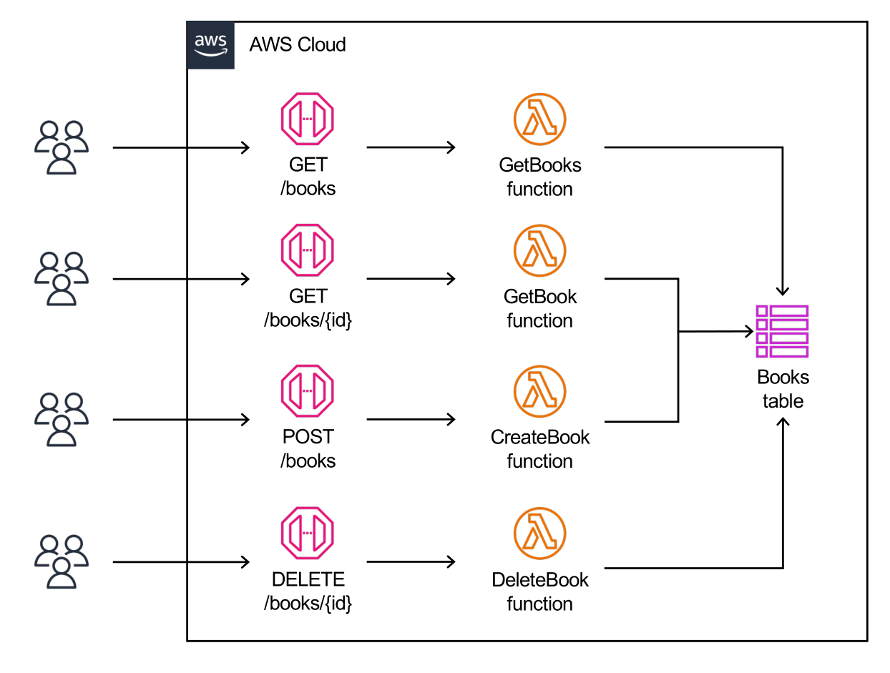

# Alessandrina

[](https://codecov.io/gh/rotiroti/alessandrina)


This project aims to build a Go-based serverless application using AWS SAM. It provides an API with endpoints for interacting with a book database, allowing users to search, create, and delete books. The project also includes a robust CI/CD pipeline for automated build, test, and deployment on AWS using GitHub Actions.

## Requirements

To set up and run this serverless application locally or in a cloud environment, ensure you have the following prerequisites:

- [AWS Account](https://aws.amazon.com/account)
- [AWS SAM CLI](https://docs.aws.amazon.com/serverless-application-model/latest/developerguide/what-is-sam.html)
- [Go Programming Language](https://go.dev)
- [GNU Make](https://www.gnu.org/software/make)
- [Docker](https://www.docker.com)
- [Artillery](https://artillery.io)
- [Localstack](https://localstack.cloud) (required only for running AWS DynamoDB locally)

Once you have these prerequisites, you can set up and run the serverless application locally or deploy it to your preferred cloud environment.

## Serverless Architecture

<p align="center">
  
</p>

## Project Structure

The serverless application is structured using the *hexagonal architecture* known as *ports and adapters*. This architectural pattern provides a way to separate the core business logic (`domain`) of the application from specific technical implementations, like the infrastructure (`database`) and the handling of client requests (`web`). Encapsulating the domain logic within the hexagon makes it easier to maintain and modify the application without affecting other components.

```shell
├── assets
├── domain
├── events
├── functions
│  ├── create-book
│  ├── delete-book
│  ├── get-book
│  └── get-books
├── go.mod
├── go.sum
├── locals.json
├── Makefile
├── README.md
├── samconfig.toml
├── scripts
│  ├── create-table.sh
│  └── delete-table.sh
├── sys
│  └── database
│     ├── ddb
│     └── memory
├── template.yaml
├── tests
│  ├── integration
│  └── performance
└── web
```

### `/functions`

This project's entire AWS Lambda functions inside the `/functions` folder. The folders under `/functions` are consistently named for each lambda that SAM will build. Each folder has a matching source code file that contains the `main` package. None of the packages inside the folder `functions` can import each other.

### `/tests`

The `/tests` folder houses a collection of `integration` and `performance` tests specifically designed to evaluate the functionality and performance of the serverless application. These tests are developed to simulate real-world scenarios and interactions with the application, ensuring it behaves as expected and performs optimally under different conditions.

### `/events`

This folder contains multiple event bodies that can be passed to SAM when invoking the AWS serverless functions locally.

```shell
sam local invoke CreateBookFunction \
   -e events/create-book.json \
   --docker-network alessandrina \
   --env-vars locals.json
```

### `/scripts`

This folder contains shell scripts to perform migrations when running DynamoDB on Localstack.

## Environment Variables

The serverless application can be configured via some environment variables.

```shell
# Set the table name (mandatory)
DB_TABLE=BooksTable-local

# Set the DynamoDB client connection (possible values: aws|localstack, default: aws)
DB_CONNECTION=localstack

# Enable AWS Client Logs for the DynamoDB service (default: false)
#
# When running with DB_CONNECTION=localstack, client logs are enabled as default
DB_LOG=true
```

## Makefile Commands

```shell
# Perform unit tests.
make unit-tests

# Run unit tests and create an HTML code coverage report.
make coverage

# Format Go source files.
make format

# Run Go linters aggregator (golangci-lint) using Docker.
make lint

# Perform integration tests. (see Integration Tests setup section)
make integration-tests

# Generate Go mocks
make mocks

# Remove Go mocks
make remove-mocks

# Cleanup artifacts, coverage and report files.
make clean
```

## Integration Tests

The integration tests assume that you have already installed all the requirements mentioned in the "Requirements" section.

### SAM Local API + Localstack DynamoDB

```shell
# 1. Create a Docker network
docker create network alessandrina

# 2. Start the Localstack server.
DOCKER_FLAGS="--network alessandrina -d" localstack start

# 3. Create a new DynamoDB table on Localstack
sh ./scripts/create-table.sh BooksTable-local

# 4. Build the serverless application.
sam build --parallel

# 5. Start a local HTTP API server using the "BooksTable-local" DynamoDB table.
sam local start-api --docker-network alessandrina --warm-containers LAZY --env-vars locals.json

# 6. Open another shell and execute the command in the project's root directory.
make integration-tests
```

### Deployed Environment (feature,dev or prod)

```shell
# 1. Build the serverless application
sam build --parallel

# 2. Run integration tests
make integration-tests API_URL=<DEPLOYED_STACK_API_URL>
```
